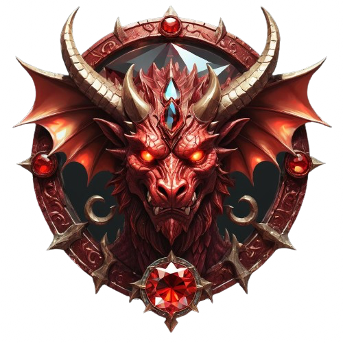

  

       
  

     
  <h1 align="center">Piekielny Rodowód</h1>

  <h3>PL</h3>
  <h2 align="center">O PROJEKCIE</h2>
  

    Piekielny Rodowód to projekt w pełni napisany przy użyciu LaTeX. Jest to scenariusz fabuły do gry D&D.  
    Dodatkowy podgląd plików .tex w załączniku po niżej:  
    https://www.overleaf.com/read/wsjtjnmpdgry#b1942f  
    Mogą wystąpić mniejsze różnice pomiędzy kodem w repozytorium a kodem na Overleaf
  

  <h2 align="center">O FABULE</h2>
  

   Gracze otrzymują zlecenie od Ravna na odzyskanie skradzionego piekielnego artefaktu w mieście Alegard. Mogą szukać informacji w różnych miejscach, takich jak dom Agona, port, rynek i slumsy. Agon, szlachcic poszkodowany przez kradzież, sugeruje sprawdzenie klasztoru Łowców Piekieł.  
    Gracze mogą też dowiedzieć się o innych podejrzanych postaciach, jak Moira, szef gangu. Podczas eksploracji, gracze mogą trafić na informacje wskazujące, że artefakt może być na statku "Wielka Anala". W końcu, po podjęciu decyzji o ataku na statek lub siedzibę gangu, dochodzi do konfrontacji. 
    Ostateczna walka z Agonem kończy się jego przemianą w demona. Podsumowując, gracze muszą podejmować decyzje, które prowadzą ich do różnych ścieżek śledztwa, dopóki nie dochodzi do ostatecznej konfrontacji z Agonem.
  

  
   
  
  <h3>ENG</h3>
  <h2 align="center">ABOUT PROJECT</h2>
  

    Piekielny Rodowód is a project fully written using LaTeX. It's a storyline script for a D&D game.  
    Additional preview of .tex files in the attachment below:  
    https://www.overleaf.com/read/wsjtjnmpdgry#b1942f  
    There may be minor differences between the code in the repository and the code on Overleaf.
  

  <h2 align="center">ABOUT STORY</h2>
  

    The players receive a task from Ravn to retrieve a stolen infernal artifact in the city of Alegard. They can gather information in various places such as Agon's mansion, the port, the market, and the slums. Agon, a nobleman affected by the theft, suggests checking the monastery of the Hell Hunters. 
    Players can also learn about other suspicious characters like Moira, the gang leader. During their exploration, players may come across information indicating that the artifact might be on the ship "Great Anala." Eventually, after deciding to attack the ship or the gang's headquarters, they face a confrontation. 
    The final battle with Agon ends with his transformation into a demon. In summary, players must make decisions that lead them down different investigation paths until they reach the ultimate confrontation with Agon.
  

